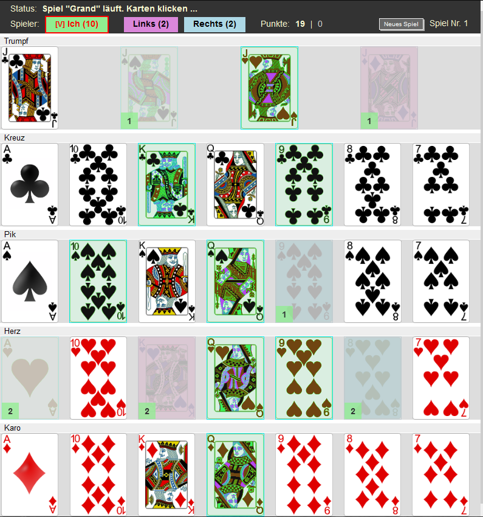

# skatbuddy

This is a simple Vue.js application that helps you to remember cards and points during a game.
Check the status in the upper left and just click on the buttons and cards during the game.



(TODO: Integrate a skat simulator that gives some playing advice)

## Try it

You can test and use the skatbuddy here:
[//moscon.de/skatbuddy](https://www.moscon.de/skatbuddy/)

You can build it by yourself via ```npm run build```

## Acknowlegement

* Respect to the [Vue.js](https://vuejs.org/) team for creating such a nice SPA framework
* Thanks to [vector-playing-cards](https://code.google.com/archive/p/vector-playing-cards/) for providing very nice open-source images of playing cards
* To Mr. Mos for developing the stuff ;)  ([moscon.de](https://www.moscon.de/))

### Empfehlung, falls Du IT-ler bist und Deutsch verstehst :)

[Jobpushy.de](https://www.jobpushy.de/) -- IT-Jobs, die dich glücklich mache

